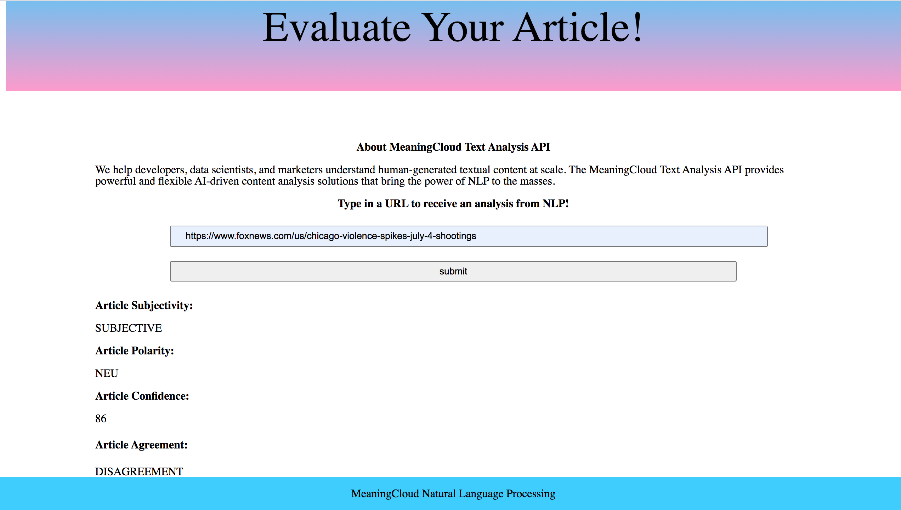

# Evaluate a News Article with Natural Language project

## Table of Contents

* [Overview](#overview)
* [Project-Rubric](#project-rubric)
* [Style-Guide](#style-guide)
* [HOW-TO-START-UP-APP](#startup)

## Overview

The goal of this project is to give the student practice with:
- Setting up Webpack
- Sass styles
- Webpack Loaders and Plugins
- Creating layouts and page design
- Service workers
- Using APIs and creating requests to external urls

In order to develop this project, we are using the concept of Natural language processing and APIs created with the purpose of evaluating Natural language. 

The students will use an API called MeaningCloud to determine various attributes of an article or blog post.

## Style-Guide

See below for the Udacity Style Guide used thoroughout the Front End Nanodegree.

* [Nanodegree Style Guide](http://udacity.github.io/frontend-nanodegree-styleguide/)

## HOW-TO-START-UP-APP
1. npm install
2. npm run build-dev
3. npm run build-prod
4. npm start

##Preview

